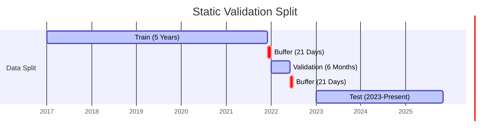
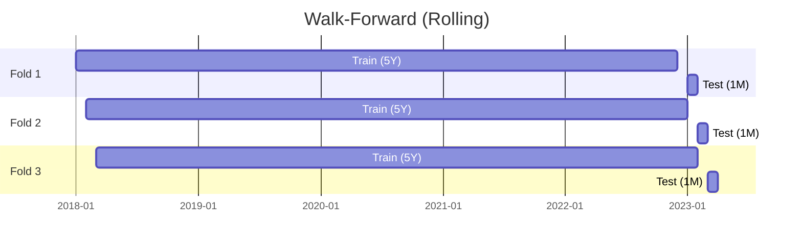

# Validation Strategies Explained

This document explains the two validation strategies used in the project: **Static** and **Walk-Forward**.

## Key Concepts

-   **Train Set**: Data used to teach the model patterns.
-   **Validation Set**: Data used to tune hyperparameters (e.g., tree depth) and prevent overfitting.
-   **Buffer (Embargo)**: A safety gap between sets to prevent "Look-Ahead Bias".
    -   *Why?* If you predict 1 month ahead, the target for `Day T` depends on `Day T+21`. If `Day T+1` is in the test set, it "knows" about `Day T+22`. A buffer ensures no overlap between the target information of the training set and the input of the test set.
-   **Test Set**: Unseen data used *only* for final evaluation.

---

## 1. Static Validation (The "Set and Forget" Approach)

In Static Validation, we split the timeline **once**. The model is trained on the past and tested on the future. It never learns from new data during the testing phase.

### Timeline

### What happens?
1.  **Training**: The model learns from 2017–2021.
2.  **Validation**: We check performance on early 2022 to pick the best model settings.
3.  **Testing**: We lock the model and run it on 2023–2025.
    -   *Pros*: Simple, fast, easy to analyze.
    -   *Cons*: The model gets "stale". By 2025, it's still using logic learned in 2021. It doesn't know about the 2023 banking crisis or 2024 AI boom.

---

## 2. Walk-Forward Validation (The "Adaptive" Approach)

In Walk-Forward (or Rolling) Validation, the model is **retrained periodically**. As time moves forward, the training window moves with it.

### Timeline (Simplified)
Imagine we retrain every month.

**Step 1 (Jan 2023 Prediction)**
-   Train: 2018–2022
-   Test: **Jan 2023**

**Step 2 (Feb 2023 Prediction)**
-   Train: 2018–2023 (Jan)  <-- *Model learns from Jan 2023!*
-   Test: **Feb 2023**

**Step 3 (Mar 2023 Prediction)**
-   Train: 2018–2023 (Feb)
-   Test: **Mar 2023**

### What happens?
1.  **Loop**: For every month in the test period:
    1.  Select the previous 5 years of data.
    2.  Train a *fresh* model.
    3.  Predict the next month.
    4.  Store prediction.
    5.  Move window forward 1 month.
2.  **Aggregation**: Combine all monthly predictions to calculate final accuracy.

-   *Pros*: Realistic. The model adapts to new regimes (e.g., high inflation).
-   *Cons*: Slow (retrains 30+ times). Harder to debug (which model was wrong? The one from Jan or Feb?).

---

## Summary Comparison

| Feature | Static | Walk-Forward |
| :--- | :--- | :--- |
| **Training Frequency** | Once | Many times (e.g., Monthly) |
| **Adaptability** | Low (Stale) | High (Adaptive) |
| **Computation** | Fast | Slow |
| **Use Case** | Research / Baseline | Production Simulation |
